# MANUEL ADMINISTRATEUR
>Mis à jour le 05 avril 2024

## Architecture

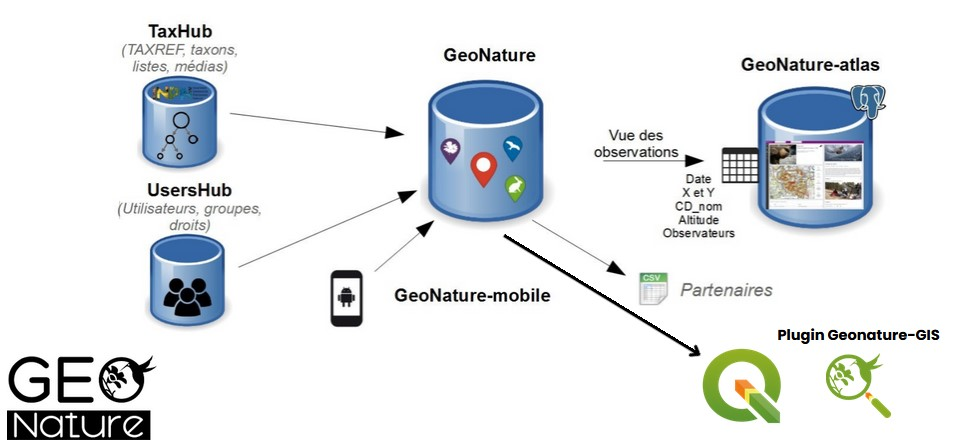

## Base de données

L’extension Geonature - GIS s’utilise obligatoirement sur une base de données Geonature.

Il s’appuie notamment sur les schémas ``ref_geo`` et ``gn_exports`` de cette même base, de la manière suivante : 

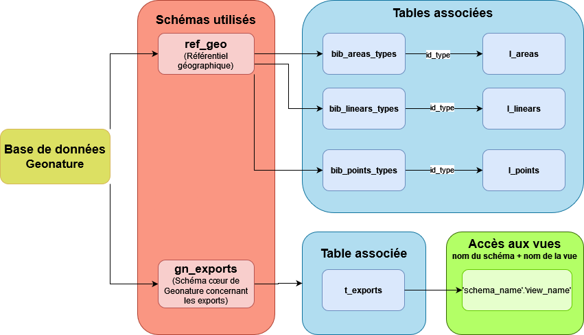

### Gestion des droits

La gestion des droits se configure uniquement depuis le SGBD. Aucun des outils proposés dans l’extension n’influence d’accès aux données contenues dans la base de données. 

Les utilisateurs doivent avoir des droits sur le schéma ``public`` sans lesquels ils ne pourront pas avoir accès à la visualisation des couches.


```
    Pour des raisons de sécurité, il est fortement conseillé de fournir **uniquement** les droits de lecture aux utilisateurs.
```


## Maintenance

Les conventions de nommage des différents widgets utilisés dans le plugin sont listés dans les parties suivantes :

### Définition des acronymes utilisés

#### Boutons
Classe | Acronyme
:--- | :--- 
QDialogButtonBox | btnBox
QPushButton | pb_
Radio Button | rb_

### Items Widgets
Classe | Acronyme
:--- | :--- 
QListWidget | lw_

#### Input Widget
Classe | Acronyme
:--- | :--- 
QLineEdit | le_
Combo Box | cb_
Line | line_

#### Display Widget
Classe | Acronyme
:--- | :--- 
QLabel | lbl_

#### QGIS Custom Widgets
Classe | Acronyme
:--- | :--- 
QgsCheckableComboBox | ccb_
QgsPasswordLineEdit | ple_
QgsFileWidget | qfw_


## Charte graphique

### Palette de couleur
Code RGB | Code Hexadécimal | Fonction
:--- | :--- | :---
rgb(245, 245, 245) | #f5f5f5 | Champ/Table
rgb(5, 144, 110) | #05906e | Bouton
rgb(255, 255, 255) | #ffffff | Texte des boutons
rgb(220, 227, 231) | #dce3e7 | Fond des fenêtres flottantes
rgb(0, 85, 127) | #00557f | Bouton “exécuter” et “export”

### Style et format des boutonṡ
Font family : Arial

Font Bold : Oui

Dimension des boutons standards : 75 x 25


# Usages
## Interface de Connexion

Afin d’accéder aux différentes fonctionnalités du plugin, il faut d’abord vous connecter à votre base de données Geonature.
Dans le menu ``Geonature - GIS``, cliquer sur “**Connexion**”. 

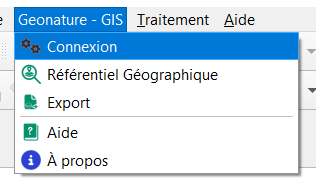

Une fenêtre s’ouvre dans laquelle il vous faudra renseigner les informations suivantes : 
 - Nom de **hôte** du serveur Geonature
 - Numéro du **port** du serveur
 - Nom de la **base de données**
 - Votre **nom d'utilisateur**
 - Votre **mot de passe**

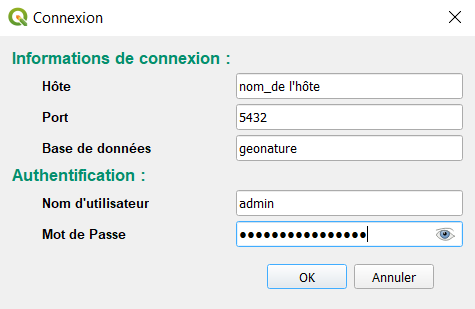

>À noter : Les **informations de connexion** et le **nom d'utilisateur** seront sauvegardés et stockés pour les prochaines sessions, cependant le **mot de passe** sera demandées à chaque nouvelle session QGIS.<br/>
*Les informations de connexion restent toutefois modifiables si besoin.*

La connexion validée, vous avez maintenant accès aux outils **référentiel géographique** et **exports** !


## Fenêtre du référentiel géographique

Dans le menu ``Geonature - GIS``, cliquer sur “**Référentiel géographique**”.

Le panneau latéral suivant s'ouvre : 

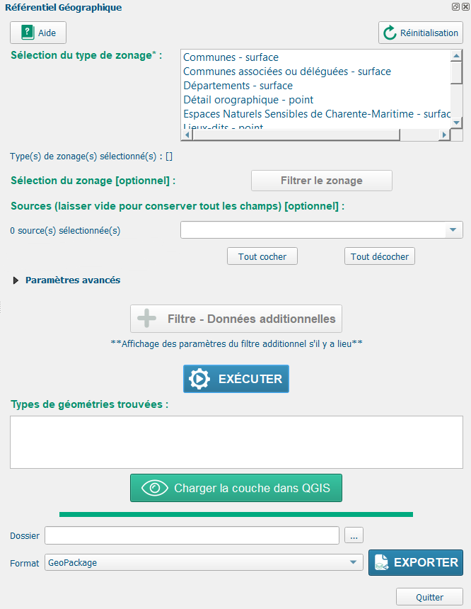


### Bouton aide
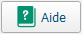
Il permet de rediriger l’utilisateur vers le manuel utilisateur pour se renseigner sur le fonctionnement du plugin. 


### Bouton Réinitialisation
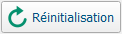
Il permet de remettre l'ensemble des paramètres saisis à zéro.


### Sélection du type de zonage

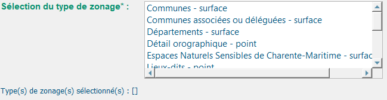

La liste de la **sélection du type de zonage** est implémentée avec les tables ``bib_areas_types``, ``bib_linears_types`` et ``bib_points_types``. Cette liste vous permet de sélectionner le ou les types de zonages que vous souhaitez filtrer et/ou exporter. Votre sélection retournera le(s) ``id_type`` correspondant au zonage. 

Il s’agit du **seul paramètre** qu’il est **obligatoire** de renseigner.

*Un texte descriptif  “**Type(s) de zonage(s) sélectionné(s)**” se mettra à jour en conséquence lors de votre sélection afin de conserver une visibilité sur celle-ci.*

```
    Attention ! Pour une nouvelle sélection, si des filtres ont été déjà paramétrés, cliquez sur le bouton de Réinitialisation.
```

### Filtrer le type de zonage
Après avoir sélectionner un type de zonage, vous avez la possibilité d’y ajouter un filtre.

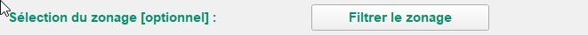

Ce bouton vous ouvrira une nouvelle fenêtre qui listera les zonages disponibles pour le type sélectionné. Cette liste récupère l'``area_name``, le ``linear_name`` ou le ``point_name`` en fonction de d'``id_type`` du type de zonage sélectionné. 
 
>Nous prendrons le type de zonage "Départements - surface" pour vous donner un exemple concret d'utilisation.

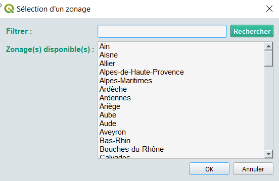

Vous allez pouvoir renseigner dans la barre de recherche "**Filtrer**" le nom du/des zonages qui vous intéresse afin de filtrer cette liste. 

```
    Attention : Les zonages se trieront uniquement lors du click sur le bouton “Rechercher”, qui lancera une requête SQL afin de filtrer les noms en fonction du ou des caractère(s) renseignés.
```

>Par exemple, si vous recherchez le département "Charente-Maritime" :

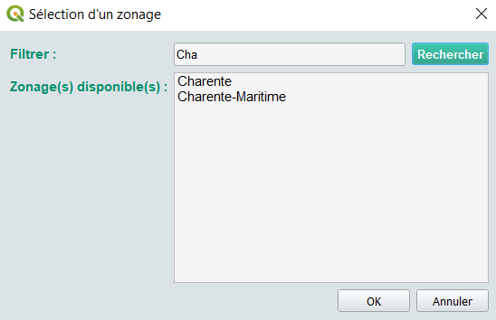

Pour sélectionnner votre ou vos zonage(s), cliquez sur leur(s) nom.

Une fois que votre sélectionne est terminée, cliquez sur "OK".


### Sélection d'une source

Une liste de **sources** vous est proposée. Celle-ci est alimentée par le champ ``source`` contenu dans les tables ``l_areas``, ``l_linears`` et ``l_points`` et filtrée avec l'``id_type`` du type de zonage sélectionné. 

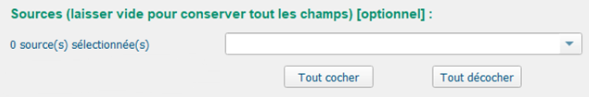

>Cliquez sur la flèche du menu déroulant pour voir s'afficher les sources de votre type de zonage.

*Un texte descriptif “source(s) trouvée(s)” se mettra à jour lors de votre sélection en comptabilisant le nombres de sources sélectionnées.*


### Paramètres avancés

Les paramètres avancés sont destinés à des utilisations spécifiques. Actuellement, ils contiennent le filtre sur les **géométries active dans Geonature** qui vous permet de filtrer le champ ``enable`` par ``true`` ou ``false``. Le bouton "Indiférent" n'ajoutera aucun filtre.

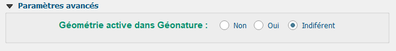


### Filtre - Données additionnelles

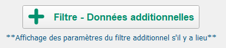

Le bouton **Filtre – Données Additionnelles** vous redirige vers une nouvelle fenêtre dans laquelle vous pourrez filtrer le champ ``additional_data``.

*Sous ce bouton, un texte descriptif se mettra à jour lors de la validation du paramétrage de votre filtre.*

```
    Un message "Pas de données additionnelles trouvées" apparaît s'il y a pas de données pour le type de zonage sélectionné.
```

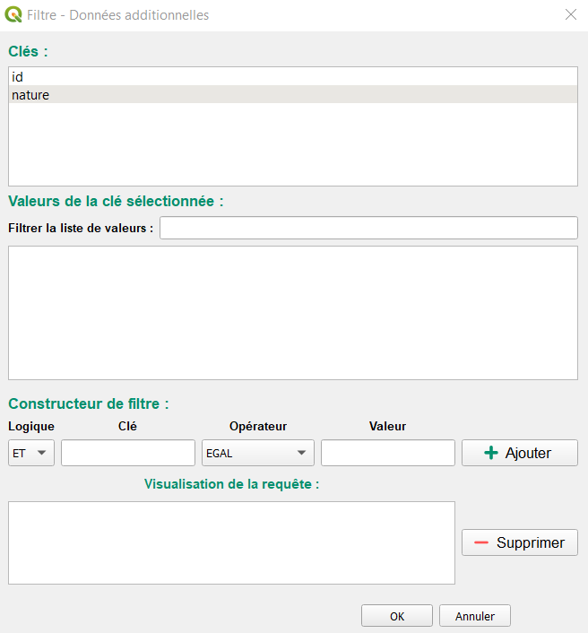

La fenêtre affichera les **clés** de ce champ. Vous pouvez choisir la clé dont vous avez besoin en cliquant dessus. Cela l'incrira dans le **Constructeur de filtre** et affichera dans l'espace "**Valeurs de la clé sélectionnée**" la liste des valeurs présentes dans cette clé. Il vous est possible de trier ces valeurs avec le champ de recherche "**Filtrer le liste de valeurs**" Pour sélectionner une valeur, double-cliquez dessus. Celle-ci ira s'inscrire dans le **Constructeur de filtre**.

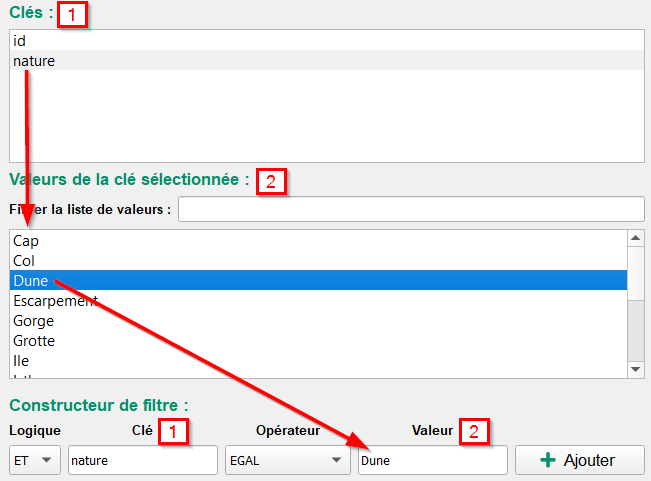

Pour finir votre filtre, vous pouvez ajuster les opérateurs logiques et les opérateurs conditionnels.

>Le **Constructeur de filtre** peut également être entièrement renseigné à la main.

**Logiques**
Opérateurs logiques | Signification
 :--- | :---
 AND | Permet de s’assurer que la condition1 **ET** la condition2 sont vrai
 OR | Vérifie si au moins l'une des conditions est vrai

Quelques exemples :
 - ``'nature' = 'Mare' AND 'espece' = 'Crapaud commun'`` renverra uniquement les données qui prennent pour ``nature`` la valeur ``Mare`` **ET** pour ``espèce`` la valeur ``Crapaud commun``.
 - ``'nature' = 'Mare' OR 'espece' = 'Crapaud commun'`` renverra toutes les données pour lesquelles ``nature = Mare`` et toutes les données pour lesquelles ``espèce = Crapaud commun``.

 **Opérateurs**
Opérateurs conditionnels | Signification
 :--- | :---
 **EGAL** | Prend exactement la valeur sélectionnée
 **PAS EGAL** | Prend toutes les valeurs sauf celle qui est sélectionnée
 **\>** | *(Pour valeur numérique uniquement)* Clé strictement supérieure à
 **<** | *(Pour valeur numérique uniquement)* Clé strictement inférieure à
 **\>=** | *(Pour valeur numérique uniquement)* Clé supérieure ou égale à
 **<=** | *(Pour valeur numérique uniquement)* Clé inférieure ou égale à
 **COMMENCE PAR** | Prend les valeurs sélectionnée qui commence par votre texte/chiffre
 **FINI PAR** | Prend les valeurs sélectionnée qui fini par votre texte/chiffre
 **CONTIENT** | Prend les valeurs sélectionnée qui comprend votre texte/chiffre

Une fois ajoutée, la requête s'inscrit dans la "**Visualisation de la requête**".

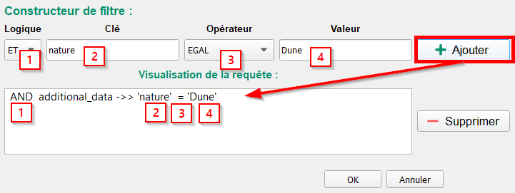

Cliquez sur "**OK**" pour validé votre filtre ou "**Annuler**" pour ne pas l'ajouter.


### Exécution du filtre


L'exécution de votre requête s'effectue lorsque vous cliquez sur le bouton "**Executer**". Une requête SQL, dans laquelle la close ``WHERE`` ira chercher le contenu des différents filtres précédemment renseignés, se lancera en conséquence et chargera en arrière-plan les données filtrées dans QGIS.


### Affichage et export du résultat

Si votre requête correspond à une ou plusieurs données, celles-ci s'afficheront dans "**Résultat de la requête**" comme ci dessous :

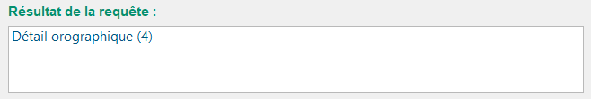

Le résultat donne le nom du ou des type(s) de zonage sélectionné(s) accompagné du nombre d'entités trouvées entre parenthèses. Chaque ligne correspond à une couche.

Sélectionner une ou plusieurs couches en cliquant dessus.


### Charger la couche dans QGIS

Après avoir séléctionné une ou plusieurs couches depuis l'encart "**Résultat de la requête**", il vous est possible de la/les afficher dans votre projet QGIS via le boutton ci-dessous.


### Exporter une ou plusieurs couches

Après avoir séléctionné une ou plusieurs couches depuis l'encart "**Résultat de la requête**", il vous est possible de les exporter.

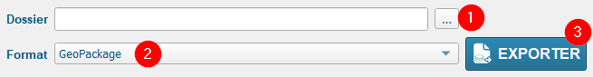

1. Pour exporter votre/vos couches, vous devez d'abord renseigner le chemin du dossier dans lequel vous allez la/les stocker.
2. Choisissez ensuite le format d'enregristrement. Les formats actuellement disponibles sont : GeoPackage, GeoJSON, CSV et XLSX.
3. Il ne vous reste plus qu'à cliquer sur "**Exporter**".


## Fenêtre des exports

Dans le menu ``Geonature - GIS``, cliquer sur “**Export**”.

Le panneau latéral suivant s'ouvre : 

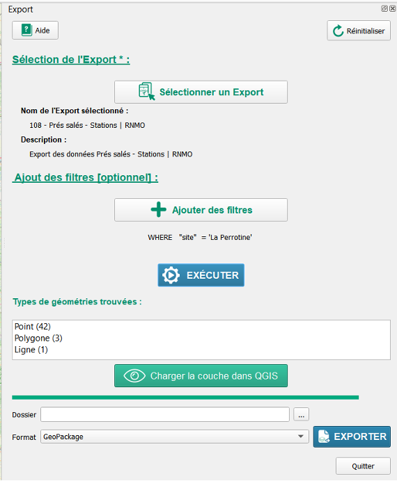


### Bouton aide

Il permet de rediriger l’utilisateur vers le manuel utilisateur pour se renseigner sur le fonctionnement du plugin. 


### Bouton Réinitialisation

Il permet de remettre l'ensemble des paramètres saisis à zéro.


### Sélection un export


Le bouton "**Sélectionner un Export**" vous ouvrira une nouvelle fenêtre qui listera les exports disponibles dans la table ``t_exports``. 

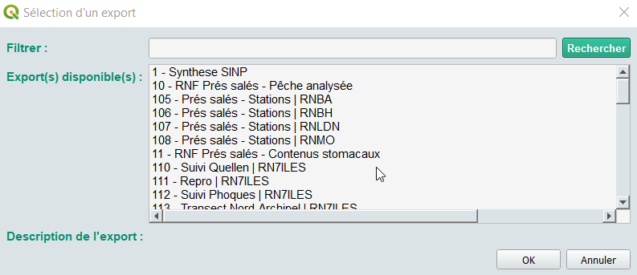
 
>Nous prendrons l'export "218 - Cuivré des marais" pour vous donner un exemple concret d'utilisation.


Vous allez pouvoir renseigner dans la barre de recherche "**Filtrer**" le nom de l'export (ou le numéro) qui vous intéresse afin de filtrer cette liste. 

```
    Attention : Les zonages se trieront uniquement lors du click sur le bouton “Rechercher”, qui lancera une requête SQL afin de filtrer les noms en fonction du ou des caractère(s) renseignés.
```

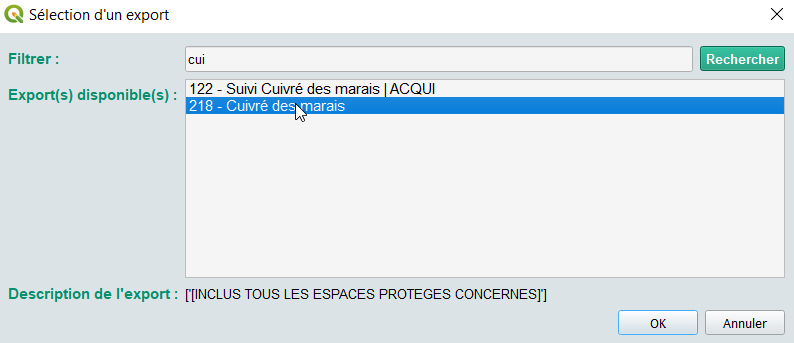

Pour sélectionnner votre export, cliquez sur son nom puis sur "**OK**"

*À votre retour sur le panneau latéral "**Export**", Un texte descriptif  (“**Nom de l'Export sélectionné**” et "**Description**") se mettra à jour en conséquence .*


### Ajouter des filtres

Le bouton **Ajouter des filtres** vous redirige vers une nouvelle fenêtre dans laquelle vous pourrez filtrer les champs de votre export.

*Sous ce bouton, un texte descriptif se mettra à jour lors de la validation du paramétrage de votre filtre.*

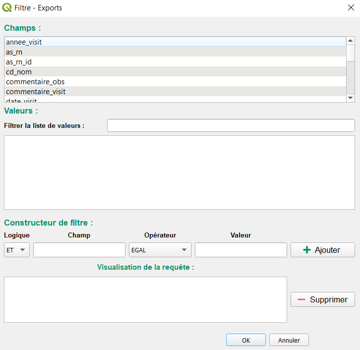

La fenêtre affichera les **champs**. Vous pouvez choisir celui dont vous avez besoin en cliquant dessus. Cela l'incrira dans le **Constructeur de filtre** et affichera dans l'espace "**Valeurs**" la liste des valeurs présentes dans ce champ. Il vous est possible de trier ces valeurs avec le champ de recherche "**Filtrer le liste de valeurs**" Pour sélectionner une valeur, double-cliquez dessus. Celle-ci ira s'inscrire dans le **Constructeur de filtre**.

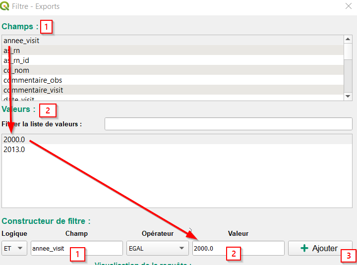

Pour finir votre filtre, vous pouvez ajuster les opérateurs logiques et les opérateurs conditionnels.

>Le **Constructeur de filtre** peut également être entièrement renseigné à la main.

**Logiques**
Opérateurs logiques | Signification
 :--- | :---
 AND | Permet de s’assurer que la condition1 **ET** la condition2 sont vrai
 OR | Vérifie si au moins l'une des conditions est vrai

Quelques exemples :
 - ``'nature' = 'Mare' AND 'espece' = 'Crapaud commun'`` renverra uniquement les données qui prennent pour ``nature`` la valeur ``Mare`` **ET** pour ``espèce`` la valeur ``Crapaud commun``.
 - ``'nature' = 'Mare' OR 'espece' = 'Crapaud commun'`` renverra toutes les données pour lesquelles ``nature = Mare`` et toutes les données pour lesquelles ``espèce = Crapaud commun``.

 **Opérateurs**
Opérateurs conditionnels | Signification
 :--- | :---
 **EGAL** | Prend exactement la valeur sélectionnée
 **PAS EGAL** | Prend toutes les valeurs sauf celle qui est sélectionnée
 **\>** | *(Pour valeur numérique uniquement)* Champ strictement supérieure à
 **<** | *(Pour valeur numérique uniquement)* Champ strictement inférieure à
 **\>=** | *(Pour valeur numérique uniquement)* Champ supérieure ou égale à
 **<=** | *(Pour valeur numérique uniquement)* Champ inférieure ou égale à
 **COMMENCE PAR** | Prend les valeurs sélectionnée qui commence par votre texte/chiffre
 **FINI PAR** | Prend les valeurs sélectionnée qui fini par votre texte/chiffre
 **CONTIENT** | Prend les valeurs sélectionnée qui comprend votre texte/chiffre

Une fois ajoutée, la requête s'inscrit dans la "**Visualisation de la requête**".

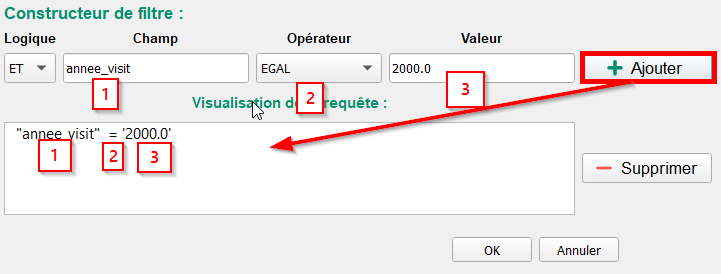 

Cliquez sur "**OK**" pour validé votre filtre ou "**Annuler**" pour ne pas l'ajouter.


### Exécution du filtre


L'exécution de votre requête s'effectue lorsque vous cliquer sur le bouton "**Executer**". Une requête SQL, dans laquelle la close ``WHERE`` ira chercher le contenu des filtres précédemment renseignés, se lancera en conséquence et chargera en arrière-plan les données filtrées dans QGIS.


### Affichage et export du résultat

Si votre requête correspond à une ou plusieurs données, celles-ci s'afficheront dans "**Types de géométrie trouvées**" comme ci dessous :

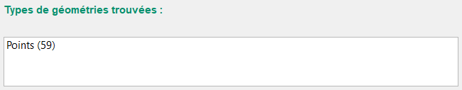

Le résultat donne le(s) type(s) de géométrie de l'export sélectionné accompagné du nombre d'entités trouvées entre parenthèses.

Sélectionner une ou plusieurs type(s) de géométrie en cliquant dessus.


### Charger la couche dans QGIS

Après avoir séléctionné une ou plusieurs géométrie(s) depuis l'encart "**Types de géométrie trouvées**", il vous est possible de la/les charger dans votre projet QGIS via le boutton ci-dessous.


### Exporter une ou plusieurs couches

Après avoir séléctionné une ou plusieurs géométrie(s) depuis l'encart "**Types de géométrie trouvées**", il vous est possible de les exporter.


1. Pour exporter votre/vos couches, vous devez d'abord renseigner le chemin du dossier dans lequel vous allez la/les stocker.
2. Choisissez ensuite le format d'enregristrement. Les formats actuellement disponibles sont : GeoPackage, GeoJSON, CSV et XLSX.
3. Il ne vous reste plus qu'à cliquer sur "**Exporter**".