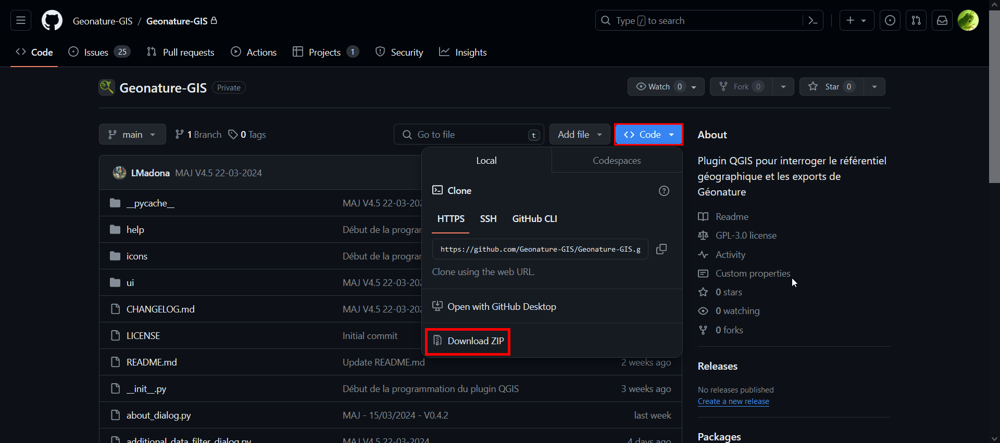
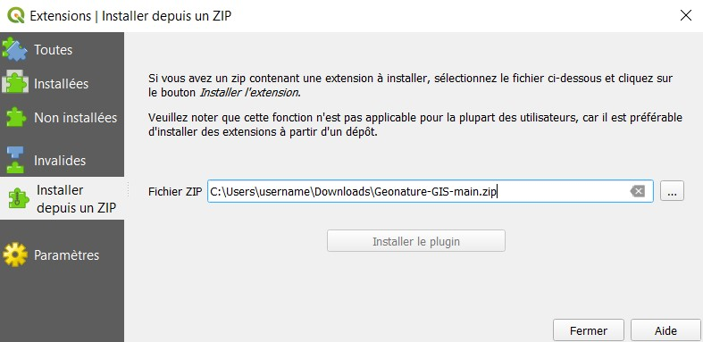
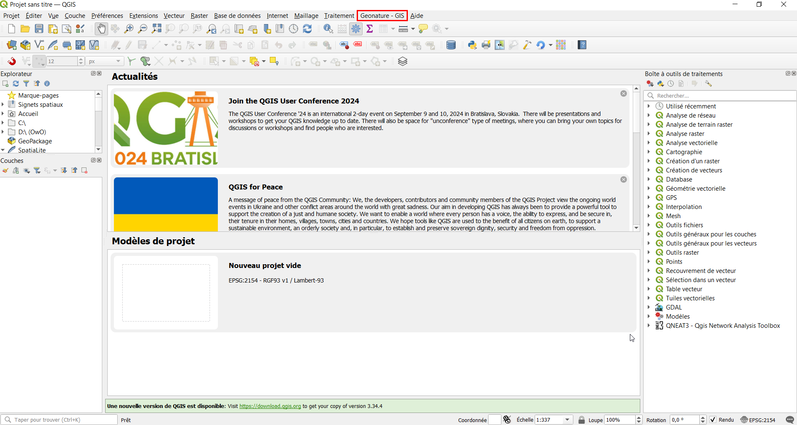

# Installation de l'extension
>mise à jour le 26 avril 2024

## Prérequis

Geonature - GIS est un plugin conçu pour lier une base de données Geonature au logiciel QGIS. 

Pour l’utiliser vous avez besoin :
 - QGIS version 3.16.11 (minimum recommandée)
 - Base de données Geonature version 2.14 (testé & fonctionnelle)


## Installation
Pour installer le plugin ``Geonature - GIS``, rendez-vous sur [son repository GitHub](https://github.com/Geonature-GIS/Geonature-GIS) et télécharger le ZIP du code source.



Ensuite, ouvrez le logiciel QGIS.

Dans l’onglet “**Extensions**”, cliquez sur “**Installer/Gérer les extensions**”, puis rendez-vous dans le menu “**Installer depuis un zip**”. Sélectionner le dossier zippé avec le bouton “**…**”, puis cliquer sur “**Installer le plugin**”.



*Si un message d’avertissement de sécurité apparaît, cliquez sur “Oui”.*

Pour savoir si le plugin s’est correctement installé, vous devriez avoir un nouvel onglet ``Geonature - GIS`` dans la barre de menu.



Si cet onglet est toujours absent, assurez-vous que l’extension soit bien activée en retournant dans “**Extensions**”>“**Installer/Gérer les extensions**”, puis dans la rubrique “**Installées**” puis cocher l’extension ``Geonature  - GIS`` si ce n’est pas déjà le cas.


## Mise à jour

```
    ATTENTION : Si une mise à jour de QGIS ou de Geonature venait à rendre inutilisable la présente extention, n'hésitez pas à le faire remontrer sur GitHubou à contacter directement d'administrateur.
```

Pour chaque mise à jour du plugin, une réinstallation sera nécessaire pour chaque utilisateur.